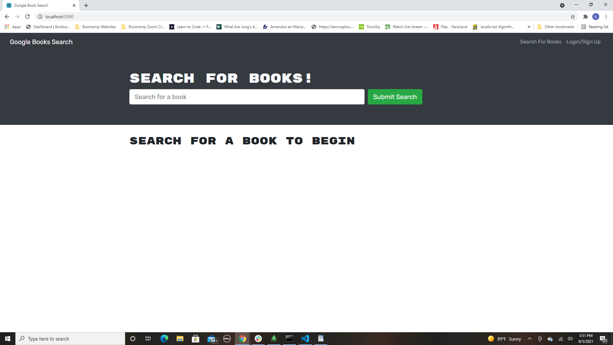
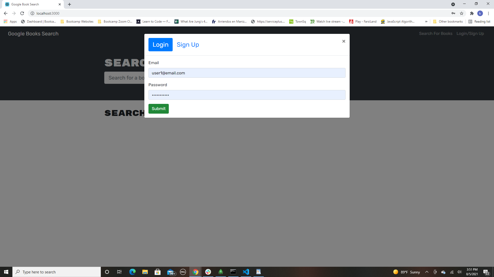
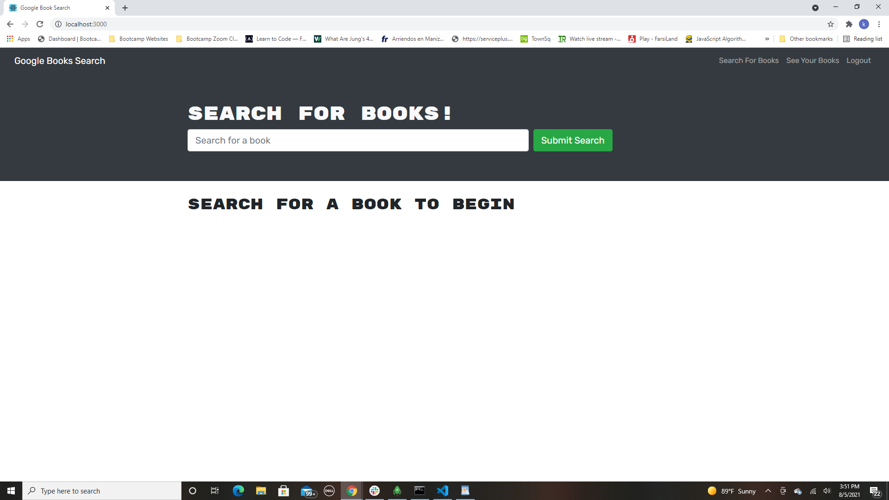

# Book-Search-Engine

Visit the Deployed Site offerd by Heroku: https://pure-shore-17356.herokuapp.com/

# Description

Do you need to find a book about a specific subject  but find it difficult to search? Maybe you want a place to look up books by a specific author, well this app has it all. You can create a profile and search for books by subject, title or author. Once you find the book you need you can save it to your saved books section for further use. 

# Installation 

just run nmp i on the outermost section of the app

# How to Use

User can visit the website using the url above and create an account in the signup section. Once an account is made, the user can save the books that they search for by clicking save this book underneath the book description. 

# Technologies Used

 - Javascript
 - React
 - Node.js
 - MERN
 - Express
 - Mongoose
 - GraphQL
 - Apollo
 - Heroku

 # Screenshots of deployed page working

# Contact

Any questions or concerns about this app, please contact me:

Github: https://github.com/kaivont85
Email: kaivont@gmail.com